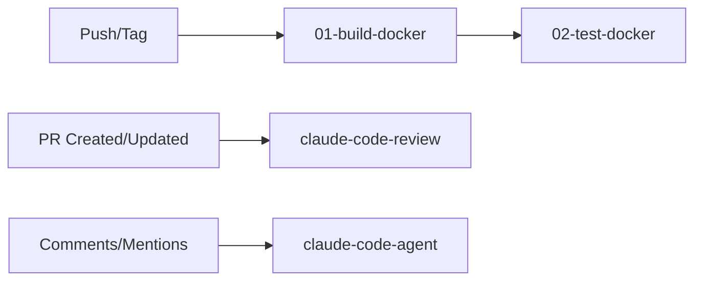

# GitHub Actions CI/CD Workflows

This directory contains the CI/CD pipeline workflows for the AST project.

## Workflow Overview

### 1. Build Pipeline
- **File**: `01-build-docker.yml`
- **Name**: Build Docker Image
- **Triggers**: Push to any branch or version tags
- **Purpose**: Builds multi-platform Docker images (amd64/arm64) and pushes to GitHub Container Registry
- **Outputs**: 
  - Branch pushes: `ghcr.io/brukhabtu/ast:{branch}` and `ghcr.io/brukhabtu/ast:sha-{sha}`
  - Release tags: `ghcr.io/brukhabtu/ast:{version}` and `ghcr.io/brukhabtu/ast:sha-{sha}`
  - Main branch also gets: `ghcr.io/brukhabtu/ast:latest`

### 2. Test Pipeline
- **File**: `02-test-docker.yml`
- **Name**: Run Tests in Docker
- **Triggers**: After successful Docker build or manual dispatch
- **Purpose**: Runs unit, integration, and e2e tests using the built Docker images
- **Test Types**:
  - Unit tests: `pytest -m unit`
  - Integration tests: `pytest -m integration`
  - E2E tests: `pytest -m e2e`
- **Features**: Parallel test execution, artifact uploads, PR comments with results

### 3. Claude AI Workflows
Two Claude-powered workflows provide AI assistance:

#### Code Review
- **File**: `claude-code-review.yml`
- **Triggers**: Pull request opened or updated
- **Purpose**: Automated AI code review with security, performance, and best practice analysis

#### Interactive Agent
- **File**: `claude-code-agent.yml`
- **Triggers**: Issue/PR comments, assignments, review comments
- **Purpose**: Interactive AI assistant that responds to mentions and helps with tasks

## Workflow Dependencies

## Manual Triggers

Several workflows support manual triggering via `workflow_dispatch`:
- **Test Pipeline**: Can specify a custom Docker image tag to test

## Environment Variables

- `REGISTRY`: `ghcr.io` (GitHub Container Registry)
- `IMAGE_NAME`: `${{ github.repository }}` (e.g., `brukhabtu/ast`)

## Secrets Required

- `GITHUB_TOKEN`: Automatically provided by GitHub Actions
- Used for:
  - Container registry authentication
  - PR/issue comments
  - Artifact uploads

## Best Practices

1. **Naming Convention**: Workflows are prefixed with numbers for logical ordering
2. **Documentation**: Each workflow includes a header explaining its purpose
3. **Modularity**: Workflows are separated by concern (build, test, review)
4. **Efficiency**: Docker layers are cached, tests run in parallel
5. **Visibility**: Build metrics and test results are reported as PR comments